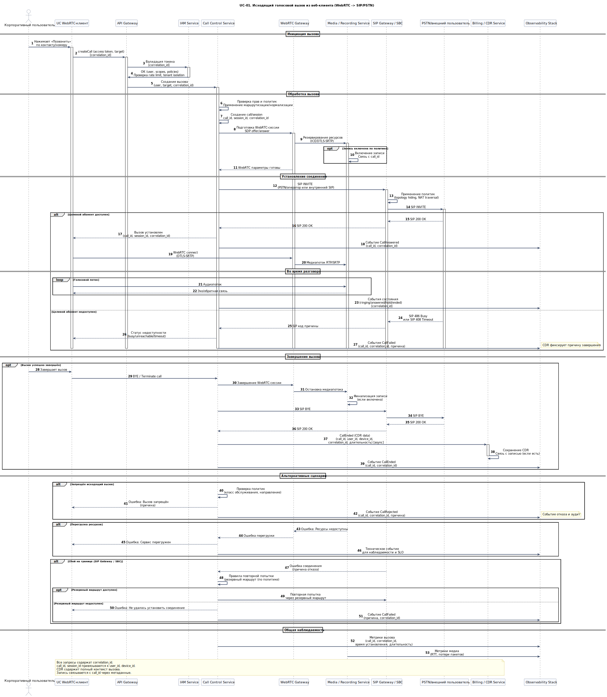

# UC-01. Исходящий голосовой вызов из веб-клиента (WebRTC -> SIP/PSTN)

**Проект:** Корпоративная платформа унифицированных коммуникаций  
(**Unified Communications, UC**)

---

## Описание

**Акторы:** Корпоративный пользователь, UC WebRTC-клиент, API Gateway, IAM Service, Call Control Service, WebRTC Gateway, SIP Gateway / SBC, Media / Recording Service, PSTN/внешний пользователь, Billing / CDR Service, Observability Stack.

**Цель:** Пользователь инициирует голосовой вызов внешнему или внутреннему абоненту из веб-клиента, с обеспечением безопасного установления сигнализации и медиаканала и формированием CDR.

**Предусловия:**
- пользователь аутентифицирован (валидный access token);
- клиент зарегистрирован/подключён к сигнальному каналу (например, WebSocket/push-канал через API Gateway);
- политики пользователя допускают исходящие вызовы (класс обслуживания, ограничения по направлениям/времени);
- для WebRTC доступен медиаконтур (ICE/STUN/TURN — если применяется выбранной архитектурой).

**Триггер:** пользователь нажимает «Позвонить» по выбранному контакту/номеру.

## Основной поток

1. Клиент формирует запрос на установление вызова (createCall) через API Gateway и передаёт access token.
2. API Gateway валидирует токен через IAM Service и применяет базовые политики безопасности (rate limit; tenant isolation — при наличии мульти-тенантности).
3. Call Control Service:
   - проверяет права пользователя и применяет правила маршрутизации/нормализации номера;
   - создаёт доменную сущность сессии вызова (call/session) и назначает `call_id`/`session_id` и `correlation_id`.
4. Call Control инициирует подготовку WebRTC-сессии (SDP offer/answer) через WebRTC Gateway.
5. WebRTC Gateway согласует параметры медиасессии (ICE/DTLS-SRTP для WebRTC) и, при необходимости:
   - резервирует ресурсы Media / Recording Service;
   - включает запись по политике (на уровне медиаконтуров/регуляторных требований).
6. Call Control инициирует вызов в сторону внешнего направления через SIP Gateway / SBC:
   - формирует SIP INVITE в сторону оператора/PSTN или внутреннего SIP-домена;
   - обеспечивает применение политик безопасности/маршрутизации на границе (topology hiding, NAT traversal и др. — по роли SBC).
7. При получении ответа от целевого абонента (200 OK) Call Control завершает установление сессии и синхронизирует состояние вызова с клиентом.
8. Медиапоток устанавливается между WebRTC-клиентом и медиаконтуром согласно выбранной топологии (через WebRTC Gateway/Media).
9. На протяжении вызова Call Control публикует события состояния (ringing/answered/ended) в канал уведомлений клиента и в поток наблюдаемости с едиными идентификаторами.
10. После завершения разговора Call Control формирует итоговые данные вызова и передаёт их в Billing / CDR Service (асинхронно) с `call_id`, `user_id`, `device_id` (при наличии), `correlation_id`.

## Альтернативные потоки

- **Недоступен целевой абонент:** Call Control завершает вызов с кодом причины и возвращает клиенту статус (busy/unreachable/timeout). CDR фиксирует причину завершения.
- **Запрещён исходящий вызов:** Call Control отклоняет попытку на этапе проверки политик (класс обслуживания, запрещённое направление), формирует событие отказа и аудит при необходимости.
- **Перегрузка ресурсов:** при невозможности выделить медиа/сигнальные ресурсы возвращается ошибка перегрузки; фиксируется техническое событие для наблюдаемости и SLO.
- **Сбой на границе (SIP Gateway / SBC):** фиксируется причина отказа; выполняются правила повторной попытки/резервного маршрута (если предусмотрено политикой маршрутизации).

## Постусловия

- CDR сформирован и сохранён;
- при включённой записи создана запись и метаданные записи связаны с `call_id`;
- события вызова доступны в наблюдаемости и связаны по `correlation_id` (для диагностики/аналитики);
- при включённой интеграции события могут быть опубликованы во внешние системы (FR-06) по контракту.

---

## Связь с требованиями

**Функциональные требования:** [FR-02](../06_requirements/index.md#fr-02-голосовая-связь-и-телефония), [FR-07](../06_requirements/index.md#fr-07-запись-разговоров-и-хранение-записей), [FR-08](../06_requirements/index.md#fr-08-cdr-и-журналы-коммуникаций), [FR-12](../06_requirements/index.md#fr-12-интероперабельность-клиентов-и-устройств), [FR-13](../06_requirements/index.md#fr-13-наблюдаемость-функционально), [FR-15](../06_requirements/index.md#fr-15-контракты-событий-и-идентификаторы-корреляции)  
**Нефункциональные требования:** [NFR-03](../06_requirements/index.md#nfr-03-производительность), [NFR-04](../06_requirements/index.md#nfr-04-безопасность), [NFR-05](../06_requirements/index.md#nfr-05-наблюдаемость)

---

## Связь с диаграммами

- **Use Case диаграмма:** [**UC-01. Use Cases корпоративного пользователя**](../11_use_case_diagrams/usecase_uc-01.md)  
- **Архитектурные диаграммы:** [**C4 Context**](../10_diagrams/c4_context.md), [**C4 Containers**](../10_diagrams/c4_containers.md), [**Deployment**](../10_diagrams/deployment.md), [**Database**](../10_diagrams/database_diagram.md), [**NoSQL Database**](../10_diagrams/nosql_database.md)

---

← [К списку Use Cases](index.md)