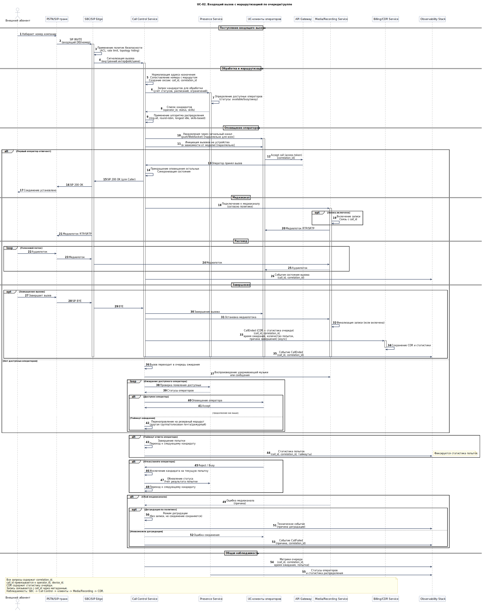

# UC-02. Входящий вызов с маршрутизацией по очереди/группе

**Проект:** Корпоративная платформа унифицированных коммуникаций  
(**Unified Communications, UC**)

---

## Описание

**Акторы:** Внешний пользователь, PSTN/SIP-транк, SIP Gateway / SBC, Call Control Service, Presence Service, UC-клиенты операторов, API Gateway, Media / Recording Service, Billing / CDR Service, Observability Stack.

**Цель:** Обработать входящий вызов на номер компании и маршрутизировать его в очередь/группу операторов с учётом правил, статусов и таймаутов, формируя CDR и (при необходимости) запись.

**Предусловия:**
- входящий DID/номер/URI известен и связан с маршрутом (очередь/группа/правило);
- операторы имеют активные сессии (зарегистрированы) и их статусы доступны;
- определены правила распределения (ring-all, round-robin, longest idle, skills-based — по политике).

**Триггер:** поступление SIP INVITE на внешней границе (SIP Gateway / SBC).

## Основной поток

1. SIP Gateway / SBC принимает SIP INVITE от оператора/транка и применяет политику безопасности (ACL, rate limit, topology hiding).
2. SBC передаёт сигнализацию в Call Control Service (внутренний интерфейс/шина).
3. Call Control:
   - нормализует адрес назначения, сопоставляет входящий номер с маршрутом;
   - создаёт сессию вызова и назначает `call_id` и `correlation_id`.
4. Call Control запрашивает у Presence Service кандидатов для обработки вызова (учёт статусов, расписаний, ограничений).
5. Call Control применяет алгоритм распределения и инициирует оповещение операторов:
   - отправляет уведомления через сигнальный канал (push/WebSocket) и/или инициирует вызовы на устройства операторов (в зависимости от выбранной модели).
6. Первый ответивший оператор принимает вызов; Call Control прекращает оповещение остальных (синхронизация состояния).
7. Media/Recording Service подключается к медиаканалу согласно политике (включая запись).
8. После завершения разговора Call Control формирует CDR и события очереди (время ожидания, количество попыток, причина завершения), отправляет в Billing / CDR Service.

## Альтернативные потоки

- **Нет доступных операторов:** вызов переходит в состояние ожидания (очередь) с политикой: удержание/музыка/сообщение; либо — на резервный маршрут (другая группа/голосовая почта/дежурный).
- **Таймаут ответа:** Call Control завершает попытку и переходит к следующему кандидату по правилам очереди; фиксируется статистика попыток.
- **Отказ/занято:** кандидат исключается на текущую попытку; учитывается Presence и результат предыдущих попыток.
- **Сбой медиаканала:** фиксируется причина; возможна деградация (например, без записи) при сохранении минимально работоспособного соединения — если предусмотрено политикой.

## Постусловия

- CDR и статистика очереди сохранены;
- при включённой записи запись и метаданные доступны и связаны с `call_id`;
- наблюдаемость содержит корреляцию по `correlation_id` для всей цепочки: SIP Gateway / SBC -> Call Control -> операторские клиенты -> Media / Recording Service -> CDR.

---

## Связь с требованиями

**Функциональные требования:** [FR-02](../06_requirements/index.md#fr-02-голосовая-связь-и-телефония), [FR-05](../06_requirements/index.md#fr-05-presence-и-статусы-пользователей), [FR-07](../06_requirements/index.md#fr-07-запись-разговоров-и-хранение-записей), [FR-08](../06_requirements/index.md#fr-08-cdr-и-журналы-коммуникаций), [FR-11](../06_requirements/index.md#fr-11-маршрутизация-и-правила-коммуникаций), [FR-12](../06_requirements/index.md#fr-12-интероперабельность-клиентов-и-устройств), [FR-13](../06_requirements/index.md#fr-13-наблюдаемость-функционально), [FR-15](../06_requirements/index.md#fr-15-контракты-событий-и-идентификаторы-корреляции)  
**Нефункциональные требования:** [NFR-02](../06_requirements/index.md#nfr-02-доступность), [NFR-03](../06_requirements/index.md#nfr-03-производительность), [NFR-06](../06_requirements/index.md#nfr-06-отказоустойчивость-и-восстановление)

---

## Связь с диаграммами

- **Use Case диаграмма:** [**UC-01. Use Cases корпоративного пользователя**](../11_use_case_diagrams/usecase_uc-01.md)  
- **Архитектурные диаграммы:** [**C4 Context**](../10_diagrams/c4_context.md), [**C4 Containers**](../10_diagrams/c4_containers.md), [**Deployment**](../10_diagrams/deployment.md), [**Database**](../10_diagrams/database_diagram.md), [**NoSQL Database**](../10_diagrams/nosql_database.md)

---

← [К списку Use Cases](index.md)