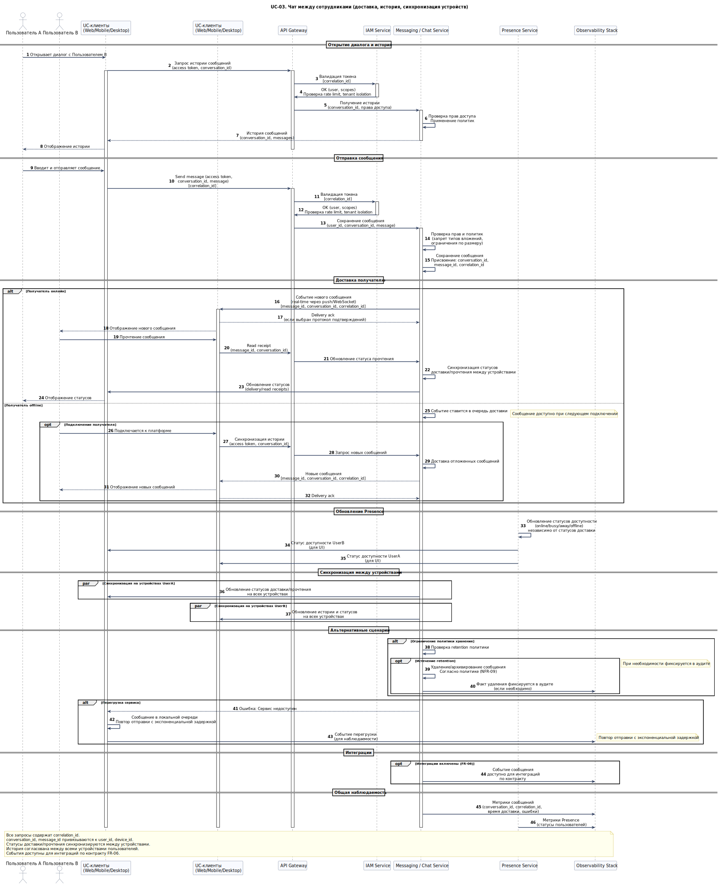

# UC-03. Чат между сотрудниками (доставка, история, синхронизация устройств)

**Проект:** Корпоративная платформа унифицированных коммуникаций  
(**Unified Communications, UC**)

---

## Описание

**Акторы:** Пользователь A, Пользователь B, UC-клиенты (Web/Mobile/Desktop), API Gateway, IAM Service, Messaging / Chat Service, Presence Service, Observability Stack.

**Цель:** Обеспечить обмен сообщениями 1:1 с сохранением истории, поиском и корректной синхронизацией между устройствами, с учётом прав доступа и политик хранения.

**Предусловия:**
- пользователи аутентифицированы (валидные access token);
- для обоих пользователей доступны политики чатов (разрешения, ограничения по вложениям);
- включена синхронизация истории между устройствами;
- клиенты подключены к сигнальному каналу (WebSocket/push через API Gateway).

**Триггер:** Пользователь A отправляет сообщение Пользователю B.

## Основной поток

1. Пользователь A открывает диалог с Пользователем B; клиент запрашивает историю сообщений (с учётом прав доступа).
2. Пользователь A отправляет сообщение; клиент передаёт запрос в API Gateway с access token.
3. API Gateway валидирует токен через IAM Service и применяет политики безопасности (rate limit; tenant isolation — при наличии мульти-тенантности).
4. Messaging / Chat Service:
   - проверяет права и применяет политики (например, запрет типов вложений, ограничения по размеру);
   - сохраняет сообщение и присваивает `conversation_id`, `message_id`, `correlation_id` (см. FR-15);
   - публикует событие нового сообщения для получателя (real-time через push/WebSocket).
5. Клиент Пользователя B получает событие; подтверждает доставку (delivery ack) — если выбран протокол подтверждений.
6. Статусы доставки/прочтения (delivery/read receipts) синхронизируются на устройствах пользователей через Messaging / Chat Service (как часть доменной логики чата).
7. Presence Service обновляет статусы доступности (online/busy/away/offline) независимо от статусов доставки сообщений и предоставляет их клиентам (при необходимости — для UI).

## Альтернативные потоки

- **Получатель offline:** событие ставится в очередь доставки; сообщение доступно при следующем подключении; клиент синхронизирует историю при восстановлении соединения.
- **Ограничение политики хранения:** при истечении retention сообщение удаляется/архивируется согласно политике (см. NFR-09); факт удаления фиксируется в аудите при необходимости.
- **Перегрузка сервиса:** при недоступности Messaging / Chat Service клиент ставит сообщение в локальную очередь и повторяет отправку с экспоненциальной задержкой; события перегрузки фиксируются для наблюдаемости.

## Постусловия

- история сообщений согласована между устройствами обоих пользователей;
- наблюдаемость содержит `conversation_id` и `correlation_id` для диагностики задержек/ошибок;
- события сообщения доступны для интеграций (при включённой политике) по контракту FR-06.

---

## Связь с требованиями

**Функциональные требования:** [FR-04](../06_requirements/index.md#fr-04-обмен-сообщениями-чат), [FR-05](../06_requirements/index.md#fr-05-presence-и-статусы-пользователей), [FR-12](../06_requirements/index.md#fr-12-интероперабельность-клиентов-и-устройств), [FR-13](../06_requirements/index.md#fr-13-наблюдаемость-функционально), [FR-15](../06_requirements/index.md#fr-15-контракты-событий-и-идентификаторы-корреляции)  
**Нефункциональные требования:** [NFR-03](../06_requirements/index.md#nfr-03-производительность), [NFR-05](../06_requirements/index.md#nfr-05-наблюдаемость), [NFR-09](../06_requirements/index.md#nfr-09-конфиденциальность-и-соответствие)

---

## Связь с диаграммами

- **Use Case диаграмма:** [**UC-01. Use Cases корпоративного пользователя**](../11_use_case_diagrams/usecase_uc-01.md)  
- **Архитектурные диаграммы:** [**C4 Context**](../10_diagrams/c4_context.md), [**C4 Containers**](../10_diagrams/c4_containers.md), [**Database**](../10_diagrams/database_diagram.md), [**NoSQL Database**](../10_diagrams/nosql_database.md)

---

← [К списку Use Cases](index.md)