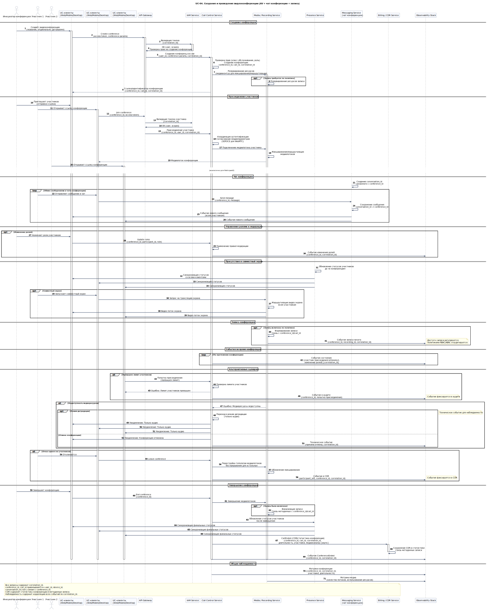

# UC-04. Создание и проведение видеоконференции (AV + чат конференции + запись)

**Проект:** Корпоративная платформа унифицированных коммуникаций  
(**Unified Communications, UC**)

---

## Описание

**Акторы:** Инициатор конференции, участники, UC-клиенты (Web/Mobile/Desktop), API Gateway, IAM Service, Call Control Service, Media / Recording Service, Presence Service, Messaging / Chat Service (чат конференции), Billing / CDR Service, Observability Stack.

**Цель:** Организовать видеоконференцию с управлением ролями, совместным экраном, чатом конференции и (опционально) записью, обеспечив сбор CDR и событий.

**Предусловия:**
- инициатор аутентифицирован и имеет права на создание конференции (класс обслуживания, роль);
- доступен медиаконтур для микширования/маршрутизации потоков;
- политика записи определена (если запись требуется);
- определены роли участников и правила модерации.

**Триггер:** Инициатор создаёт новую видеоконференцию через клиент.

## Основной поток

1. Инициатор создаёт конференцию через клиент; запрос передаётся в API Gateway с токеном.
2. API Gateway валидирует токен через IAM; Call Control проверяет права и создаёт конференц-сессию, назначая `conference_id`, `call_id`, `correlation_id`.
3. Call Control резервирует ресурсы Media / Recording Service и возвращает ссылку/идентификатор конференции клиенту.
4. Участники присоединяются по ссылке; Call Control координирует аутентификацию участников и согласование медиапараметров (SDP/ICE для WebRTC).
5. Media / Recording Service обеспечивает микширование/маршрутизацию медиапотоков; чат конференции обслуживается Messaging / Chat Service с `conversation_id`, связанным с `conference_id`.
6. Presence Service обновляет статусы участников до «в конференции» и синхронизирует с клиентами.
7. При необходимости (по политике) включается запись; Media/Recording Service формирует запись и связывает её с `conference_id`/`call_id`; доступ к записи регулируется политиками (RBAC/ABAC) и аудитируется.
8. На протяжении конференции Call Control публикует события состояния (участник присоединился/покинул, изменение ролей) в поток наблюдаемости.
9. После завершения Call Control формирует CDR/статистику конференции (длительность, участники, медиаканалы) и метаданные записи, отправляет в Billing / CDR Service с едиными идентификаторами корреляции.

## Альтернативные потоки

- **Превышен лимит участников:** Call Control отклоняет присоединение дополнительных участников с уведомлением; событие фиксируется в аудите.
- **Недоступность медиаресурсов:** конференция переходит в режим деградации (только аудио) или отменяется с уведомлением участников; техническое событие фиксируется для наблюдаемости.
- **Отказ одного из участников:** Media / Recording Service перестраивает топологию медиапотоков без прерывания конференции для остальных участников; событие фиксируется в CDR.

## Постусловия

- CDR и статистика конференции сохранены в Billing / CDR Service;
- при включённой записи запись и метаданные доступны в Media / Recording Service и связаны с `conference_id`/`call_id`;
- наблюдаемость содержит корреляцию всех событий конференции по `correlation_id`;
- статусы Presence участников обновлены после завершения.

---

## Связь с требованиями

**Функциональные требования:** [FR-03](../06_requirements/index.md#fr-03-видеоконференции-и-совместная-работа), [FR-04](../06_requirements/index.md#fr-04-обмен-сообщениями-чат), [FR-05](../06_requirements/index.md#fr-05-presence-и-статусы-пользователей), [FR-07](../06_requirements/index.md#fr-07-запись-разговоров-и-хранение-записей), [FR-08](../06_requirements/index.md#fr-08-cdr-и-журналы-коммуникаций), [FR-12](../06_requirements/index.md#fr-12-интероперабельность-клиентов-и-устройств), [FR-13](../06_requirements/index.md#fr-13-наблюдаемость-функционально), [FR-15](../06_requirements/index.md#fr-15-контракты-событий-и-идентификаторы-корреляции)  
**Нефункциональные требования:** [NFR-01](../06_requirements/index.md#nfr-01-масштабируемость), [NFR-02](../06_requirements/index.md#nfr-02-доступность), [NFR-03](../06_requirements/index.md#nfr-03-производительность)

---

## Связь с диаграммами

- **Use Case диаграмма:** [**UC-01. Use Cases корпоративного пользователя**](../11_use_case_diagrams/usecase_uc-01.md)  
- **Архитектурные диаграммы:** [**C4 Context**](../10_diagrams/c4_context.md), [**C4 Containers**](../10_diagrams/c4_containers.md), [**Deployment**](../10_diagrams/deployment.md), [**Database**](../10_diagrams/database_diagram.md), [**NoSQL Database**](../10_diagrams/nosql_database.md)

---

← [К списку Use Cases](index.md)