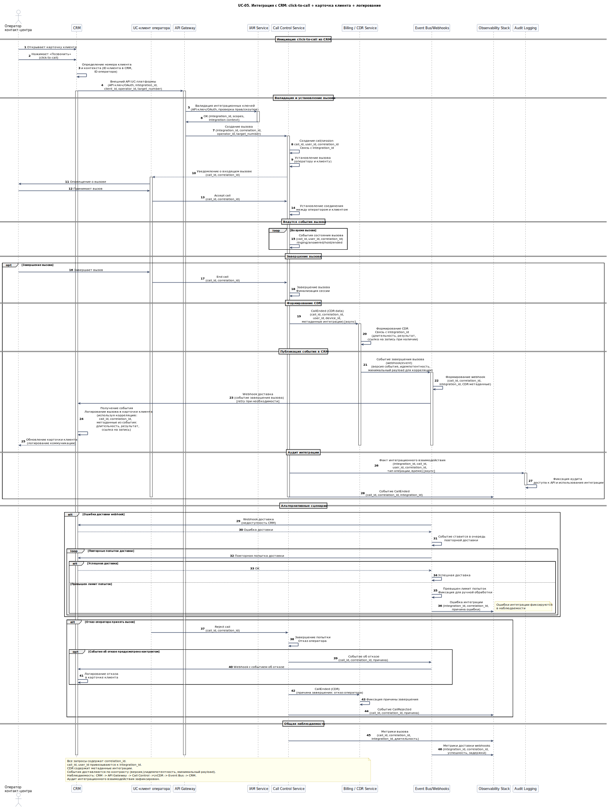

# UC-05. Интеграция с CRM: click-to-call + карточка клиента + логирование

**Проект:** Корпоративная платформа унифицированных коммуникаций  
(**Unified Communications, UC**)

---

## Описание

**Акторы:** Оператор контакт-центра, CRM, UC-клиент оператора, API Gateway, IAM Service, Call Control Service, Billing / CDR Service, Event Bus/Webhooks, Observability Stack, Audit Logging.

**Цель:** Обеспечить вызов из CRM (click-to-call) и автоматическое логирование результата взаимодействия в CRM по событиям платформы, с обеспечением бизнес-контекста и аудита интеграции.

**Предусловия:**
- оператор аутентифицирован в CRM и UC-платформе;
- интеграция CRM с UC-платформой настроена (API ключи, webhooks, политики доступа);
- политика логирования коммуникаций в CRM определена.

**Триггер:** Оператор инициирует click-to-call из карточки клиента в CRM.

## Основной поток

1. Оператор инициирует click-to-call в CRM; CRM определяет номер клиента и контекст (ID клиента в CRM, ID оператора).
2. CRM вызывает внешний API UC-платформы через API Gateway (аутентификация интеграции по API ключу/OAuth, проверка прав/скоупов интеграции).
3. API Gateway валидирует интеграционные ключи и передаёт запрос в Call Control Service с контекстом интеграции (`integration_id`, `correlation_id`).
4. Call Control устанавливает вызов и ведёт события состояния вызова с едиными идентификаторами (`call_id`, `user_id`, `correlation_id`).
5. По завершении вызова CDR формируется в Billing / CDR Service с контекстом (`call_id`, `correlation_id`, `user_id`, `device_id`, метаданные интеграции).
6. Billing / CDR Service публикует событие завершения вызова (webhook/event через Event Bus) в CRM по контракту (версия события, идемпотентность, минимальный payload для корреляции).
7. CRM получает событие и логирует вызов в карточке клиента, используя корреляцию (`call_id`, `correlation_id`) и метаданные из события (длительность, результат, ссылка на запись при наличии).
8. Факт интеграционного взаимодействия фиксируется в Audit Logging для аудита доступа к API и использования интеграции.

## Альтернативные потоки

- **Ошибка доставки webhook:** при недоступности CRM событие ставится в очередь повторной доставки; после превышения лимита попыток фиксируется для ручной обработки; ошибки интеграции фиксируются в наблюдаемости.
- **Отказ оператора принять вызов:** Call Control завершает попытку; событие об отказе публикуется в CRM (если предусмотрено контрактом); CDR фиксирует причину завершения.

## Постусловия

- CDR вызова сохранён и связан с метаданными интеграции;
- событие завершения вызова доставлено в CRM и залогировано;
- наблюдаемость содержит корреляцию по `correlation_id` для цепочки: CRM -> API Gateway -> Call Control -> CDR -> Event Bus -> CRM;
- аудит интеграционного взаимодействия зафиксирован.

---

## Связь с требованиями

**Функциональные требования:** [FR-06](../06_requirements/index.md#fr-06-интеграция-с-бизнес-системами), [FR-08](../06_requirements/index.md#fr-08-cdr-и-журналы-коммуникаций), [FR-14](../06_requirements/index.md#fr-14-аудит-и-соответствие-функционально), [FR-15](../06_requirements/index.md#fr-15-контракты-событий-и-идентификаторы-корреляции)  
**Нефункциональные требования:** [NFR-04](../06_requirements/index.md#nfr-04-безопасность), [NFR-07](../06_requirements/index.md#nfr-07-сопровождаемость), [NFR-08](../06_requirements/index.md#nfr-08-совместимость-и-расширяемость)

---

## Связь с диаграммами

- **Use Case диаграмма:** [**UC-01. Use Cases корпоративного пользователя**](../11_use_case_diagrams/usecase_uc-01.md)  
- **Архитектурные диаграммы:** [**C4 Context**](../10_diagrams/c4_context.md), [**C4 Containers**](../10_diagrams/c4_containers.md), [**Deployment**](../10_diagrams/deployment.md), [**Database**](../10_diagrams/database_diagram.md), [**NoSQL Database**](../10_diagrams/nosql_database.md)

---

← [К списку Use Cases](index.md)