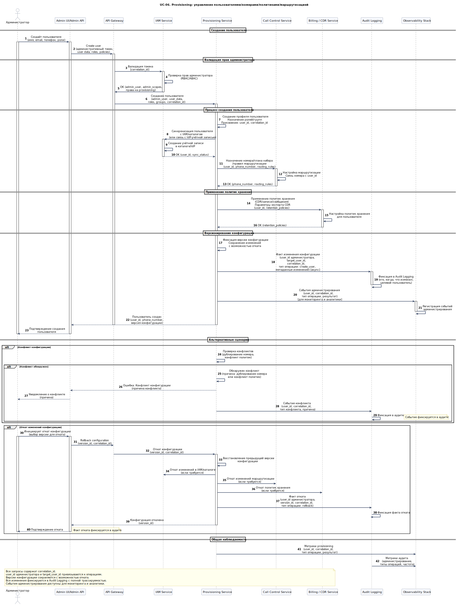

# UC-06. Provisioning: управление пользователями/номерами/политиками/маршрутизацией

**Проект:** Корпоративная платформа унифицированных коммуникаций  
(**Unified Communications, UC**)

---

## Описание

**Акторы:** Администратор, Admin UI/Admin API, API Gateway, IAM Service, Provisioning Service, Call Control Service, Billing / CDR Service, Audit Logging, Observability Stack.

**Цель:** Централизованно управлять пользователями, ролями, номерами, правилами маршрутизации и интеграциями, с контролем изменений, версионированием конфигураций, откатами и аудитом.

**Предусловия:**
- администратор аутентифицирован и имеет права администратора (RBAC/ABAC);
- администраторский интерфейс доступен через Admin UI/Admin API;
- политики управления конфигурацией определены (версионирование, откаты, аудит).

**Триггер:** Администратор инициирует операцию управления (создание пользователя, изменение политик, настройка маршрутизации).

## Основной поток (создание пользователя)

1. Администратор создаёт пользователя через Admin UI/Admin API; запрос передаётся в API Gateway с административным токеном.
2. API Gateway валидирует токен через IAM Service и проверяет права администратора (RBAC/ABAC).
3. Provisioning Service:
   - создаёт профиль пользователя и назначает роли/группы;
   - синхронизирует пользователя с IAM/каталогом (или связывает с IdP-учётной записью);
   - назначает номер/план набора/правила маршрутизации в Call Control Service.
4. Provisioning применяет политики хранения данных (CDR/записи/сообщения) и параметры экспорта CDR через Billing / CDR Service.
5. Provisioning фиксирует версию конфигурации и сохраняет изменения с возможностью отката.
6. Все изменения фиксируются в Audit Logging с `user_id` (администратора), `target_user_id`, `correlation_id`, типом операции и метаданными изменений.
7. Observability Stack фиксирует события администрирования для мониторинга и аналитики.

## Альтернативные потоки

- **Конфликт конфигурации:** при обнаружении конфликта (дублирование номера, конфликт политик) Provisioning отклоняет изменение с уведомлением; событие фиксируется в аудите.
- **Откат изменений:** администратор инициирует откат конфигурации; Provisioning восстанавливает предыдущую версию; факт отката фиксируется в аудите.

## Постусловия

- пользователь создан и синхронизирован с IAM/каталогом;
- номер и правила маршрутизации назначены в Call Control;
- политики хранения применены;
- изменения зафиксированы в Audit Logging;
- версия конфигурации сохранена и доступна для отката.

---

## Связь с требованиями

**Функциональные требования:** [FR-01](../06_requirements/index.md#fr-01-управление-пользователями-и-устройствами), [FR-10](../06_requirements/index.md#fr-10-администрирование-и-конфигурация), [FR-11](../06_requirements/index.md#fr-11-маршрутизация-и-правила-коммуникаций), [FR-14](../06_requirements/index.md#fr-14-аудит-и-соответствие-функционально), [FR-15](../06_requirements/index.md#fr-15-контракты-событий-и-идентификаторы-корреляции)  
**Нефункциональные требования:** [NFR-04](../06_requirements/index.md#nfr-04-безопасность), [NFR-10](../06_requirements/index.md#nfr-10-управляемость)

---

## Связь с диаграммами

- **Use Case диаграмма:** [**UC-03. Use Cases администратора UC**](../11_use_case_diagrams/usecase_uc-03.md)  
- **Архитектурные диаграммы:** [**C4 Context**](../10_diagrams/c4_context.md), [**C4 Containers**](../10_diagrams/c4_containers.md), [**Deployment**](../10_diagrams/deployment.md), [**Database**](../10_diagrams/database_diagram.md), [**NoSQL Database**](../10_diagrams/nosql_database.md)

---

← [К списку Use Cases](index.md)