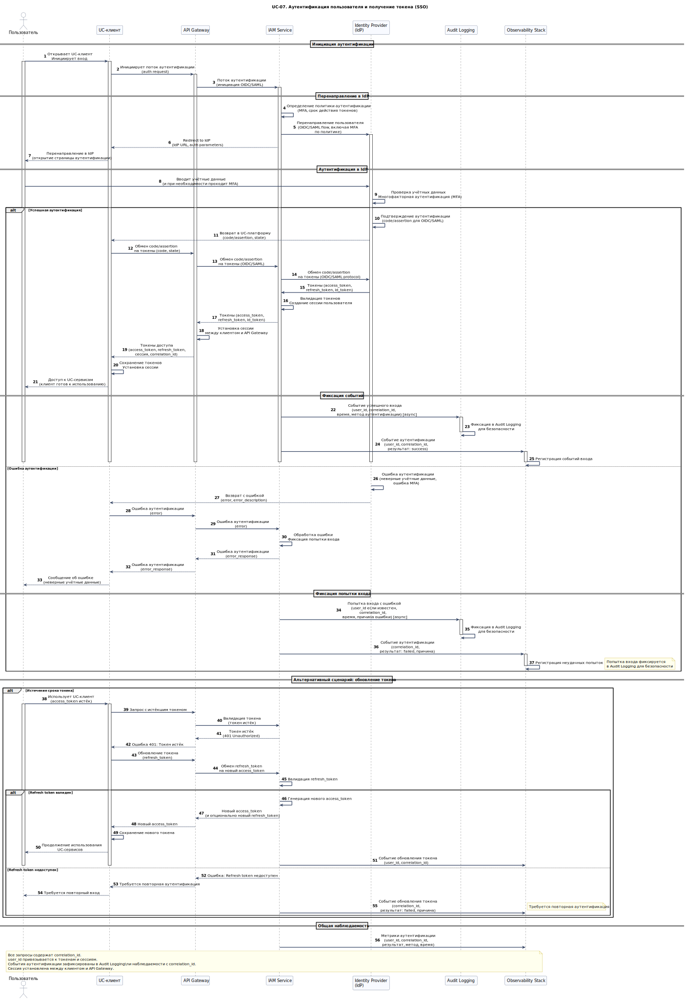

# UC-07. Аутентификация пользователя и получение токена (SSO)

**Проект:** Корпоративная платформа унифицированных коммуникаций  
(**Unified Communications, UC**)

---

## Описание

**Акторы:** Пользователь, UC-клиент, API Gateway, IAM Service, Identity Provider (IdP).

**Цель:** Пользователь проходит аутентификацию через корпоративный IdP и получает токены доступа к UC-сервисам.

**Предусловия:**
- корпоративный IdP (OIDC/SAML) настроен и доступен;
- политика аутентификации определена (MFA, срок действия токенов).

**Триггер:** Пользователь открывает UC-клиент и инициирует вход.

## Основной поток

1. Пользователь открывает UC-клиент и инициирует вход.
2. Клиент инициирует поток аутентификации через API Gateway.
3. IAM перенаправляет пользователя в IdP (OIDC/SAML), включая MFA по политике.
4. После успешного входа IAM получает code/assertion и обменивает на токены.
5. API Gateway устанавливает сессию и возвращает токены клиенту.
6. Клиент использует токен для последующих запросов; события входа фиксируются аудитом и наблюдаемостью с `correlation_id`.

## Альтернативные потоки

- **Ошибка аутентификации:** при неудачной аутентификации в IdP IAM возвращает ошибку клиенту; попытка входа фиксируется в Audit Logging для безопасности.
- **Истечение срока токена:** при истечении токена клиент запрашивает обновление через refresh token; при недоступности refresh token требуется повторная аутентификация.

## Постусловия

- пользователь аутентифицирован и имеет валидные токены доступа;
- сессия установлена между клиентом и API Gateway;
- события аутентификации зафиксированы в Audit Logging и наблюдаемости с `correlation_id`.

---

## Связь с требованиями

**Функциональные требования:** [FR-01](../06_requirements/index.md#fr-01-управление-пользователями-и-устройствами), [FR-14](../06_requirements/index.md#fr-14-аудит-и-соответствие-функционально), [FR-15](../06_requirements/index.md#fr-15-контракты-событий-и-идентификаторы-корреляции)  
**Нефункциональные требования:** [NFR-04](../06_requirements/index.md#nfr-04-безопасность), [NFR-09](../06_requirements/index.md#nfr-09-конфиденциальность-и-соответствие)

---

## Связь с диаграммами

- **Use Case диаграмма:** [**UC-01. Use Cases корпоративного пользователя**](../11_use_case_diagrams/usecase_uc-01.md)  
- **Архитектурные диаграммы:** [**C4 Context**](../10_diagrams/c4_context.md), [**C4 Containers**](../10_diagrams/c4_containers.md), [**Deployment**](../10_diagrams/deployment.md), [**Database**](../10_diagrams/database_diagram.md), [**NoSQL Database**](../10_diagrams/nosql_database.md)

---

← [К списку Use Cases](index.md)