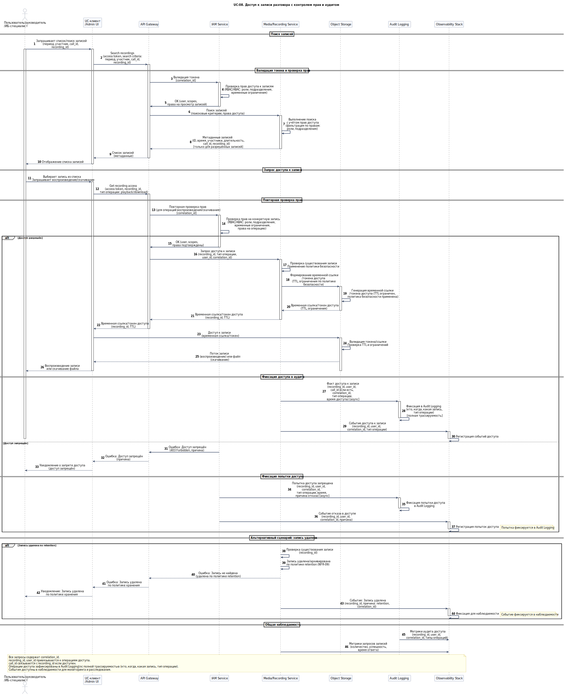

# UC-08. Доступ к записи разговора с контролем прав и аудитом

**Проект:** Корпоративная платформа унифицированных коммуникаций  
(**Unified Communications, UC**)

---

## Описание

**Акторы:** Пользователь/руководитель/ИБ-специалист, UC-клиент/Admin UI, API Gateway, IAM Service, Media / Recording Service, Object Storage, Audit Logging, Observability Stack.

**Цель:** Предоставить доступ к записи разговора с проверкой прав (RBAC/ABAC) и фиксацией аудита доступа.

**Предусловия:**
- пользователь аутентифицирован (валидный access token);
- политики доступа к записям определены (роли, подразделения, временные ограничения);
- записи доступны в Object Storage и каталогизированы в Media / Recording Service.

**Триггер:** Пользователь запрашивает доступ к записи через клиент/интерфейс.

## Основной поток (поиск и воспроизведение записи)

1. Пользователь запрашивает список/поиск записей по критериям (период, участник, `call_id`, `recording_id`) через клиент/Admin UI; запрос передаётся в API Gateway с токеном.
2. API Gateway валидирует токен через IAM Service; IAM проверяет права доступа к записям (RBAC/ABAC).
3. Media / Recording Service выполняет поиск записей с учётом прав и возвращает метаданные (ID, время, участники, длительность).
4. Пользователь запрашивает воспроизведение/скачивание конкретной записи; запрос передаётся в API Gateway.
5. API Gateway выполняет повторную проверку прав через IAM Service (для операций воспроизведения/скачивания).
6. Media / Recording Service формирует временную ссылку/токен доступа к Object Storage (TTL, ограничения по политике безопасности) и возвращает клиенту.
7. Факт доступа фиксируется в Audit Logging с `recording_id`, `user_id`, `call_id` (при наличии), `correlation_id`, типом операции и временем.

## Альтернативные потоки

- **Доступ запрещён:** IAM отклоняет запрос; попытка фиксируется в Audit Logging.
- **Запись удалена по retention:** Media / Recording Service возвращает «не найдена/удалена по политике retention»; событие фиксируется в наблюдаемости.

## Постусловия

- операции доступа зафиксированы в Audit Logging с полной трассируемостью;
- события доступны в наблюдаемости для мониторинга и расследования.

---

## Связь с требованиями

**Функциональные требования:** FR-07, FR-14, FR-15  
**Нефункциональные требования:** NFR-04, NFR-09

---

## Связь с диаграммами

Sequence: **UC_Seq_Recording_Access** (план)

---

← [К списку Use Cases](index.md)