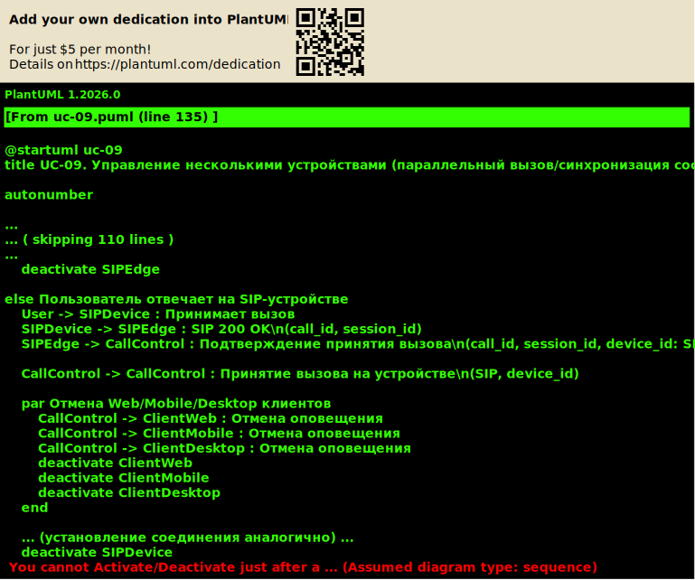

# UC-09. Управление несколькими устройствами (параллельный вызов/синхронизация состояния)

**Проект:** Корпоративная платформа унифицированных коммуникаций  
(**Unified Communications, UC**)

---

## Описание

**Акторы:** Пользователь, несколько UC-клиентов/SIP-устройств, Call Control Service, Presence Service, API Gateway, SIP Gateway / SBC, Observability Stack.

**Цель:** Обеспечить предсказуемое поведение при наличии нескольких устройств пользователя: оповещение, ответ на одном устройстве, синхронизация состояния вызова и Presence между устройствами.

**Предусловия:**
- пользователь зарегистрирован на нескольких устройствах (Web/Mobile/Desktop/SIP);
- политика «несколько устройств» определена (параллельный/последовательный вызов, лимиты регистраций);
- устройства подключены к сигнальному каналу (push/WebSocket или SIP-регистрация).

**Триггер:** входящий вызов адресован пользователю.

## Основной поток (вариант «параллельный вызов»)

1. Входящий вызов поступает через SIP Gateway / SBC (PSTN/SIP) или создаётся внутри домена.
2. Call Control получает список активных устройств/регистраций пользователя и проверяет политику оповещения.
3. Call Control инициирует оповещение устройств:
   - push/WebSocket для Web/Mobile/Desktop клиентов;
   - SIP INVITE для SIP-устройств через SIP Gateway / SBC;
   - присваивает `call_id`, `session_id`, `correlation_id` и связывает их с `user_id` и `device_id`.
4. Одно из устройств принимает вызов; подтверждение поступает в Call Control (через API Gateway или SIP-ответ).
5. Call Control отменяет оповещение остальных устройств (push-команда отмены и/или SIP CANCEL) и синхронизирует финальные состояния.
6. Presence Service обновляет статус пользователя до «в звонке» и синхронизирует статус со всеми активными устройствами.
7. Call Control публикует события состояния (answered/hold/ended) в поток наблюдаемости с едиными идентификаторами корреляции.
8. После завершения Presence Service обновляет статус пользователя до актуального и синхронизирует со всеми устройствами.

## Альтернативные потоки

- **Последовательный вызов:** устройства оповещаются последовательно с таймаутом; статистика попыток фиксируется в CDR.
- **Превышен лимит регистраций:** применяется политика ограничения (отклонение новой регистрации или вытеснение старой); событие фиксируется в аудите.
- **Ошибка синхронизации состояния:** Call Control повторяет команды синхронизации; ошибки фиксируются в наблюдаемости.

## Постусловия

- вызов принят на одном устройстве, остальные получили отмену оповещения;
- состояние вызова синхронизировано между устройствами;
- Presence обновлён и синхронизирован;
- наблюдаемость содержит корреляцию событий по `correlation_id`.

---

## Связь с требованиями

**Функциональные требования:** FR-12, FR-05, FR-02, FR-15  
**Нефункциональные требования:** NFR-03, NFR-05

---

## Связь с диаграммами

Sequence: **UC_Seq_MultiDevice_Incoming** (план)

---

← [К списку Use Cases](index.md)