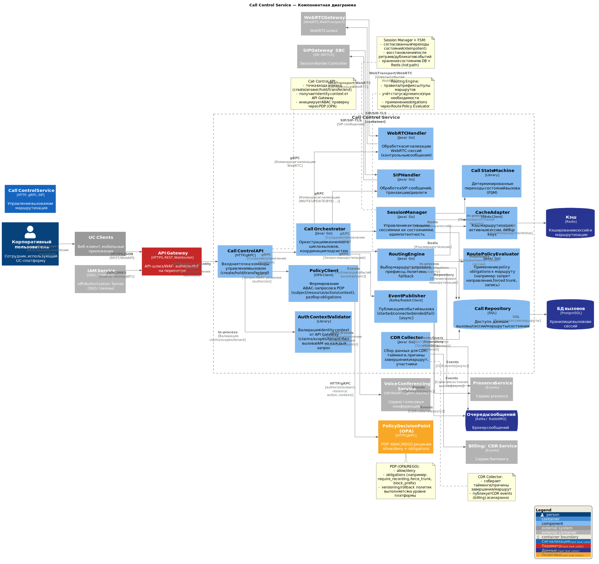

# C4 Component Diagram

## Назначение диаграммы

Диаграмма C4 Component описывает внутреннюю структуру ключевого контейнера UC-платформы — **Call Control Service** — на уровне компонентов и их взаимодействий.

## Основные компоненты Call Control Service

- **Call Orchestrator** — оркестрация жизненного цикла вызовов
- **Routing Engine** — маршрутизация вызовов по правилам
- **Session Manager** — управление активными сессиями вызовов
- **SIP Handler** — обработка SIP-сообщений
- **WebRTC Handler** — обработка WebRTC-сигнализации
- **CDR Collector** — сбор данных для CDR
- **Call Repository** — доступ к данным вызовов
- **Cache Adapter** — доступ к кэшу

## Архитектурный смысл

Диаграмма демонстрирует декомпозицию Call Control Service на логические компоненты, их ответственность и взаимодействие. Это отражает принципы модульной архитектуры и разделения ответственности:

- **Оркестрация** (Call Orchestrator) отделена от **логики маршрутизации** (Routing Engine)
- **Управление сессиями** (Session Manager) изолировано от **обработки протоколов** (SIP Handler, WebRTC Handler)
- **Сбор CDR** (CDR Collector) выполняется асинхронно и не блокирует основной поток обработки вызовов
- Использование **Repository** и **Cache Adapter** для абстракции доступа к данным

Диаграмма поддерживает архитектурные драйверы **AD-01**, **AD-02**, **AD-03** и решения из ADR-001, ADR-002, ADR-005.
