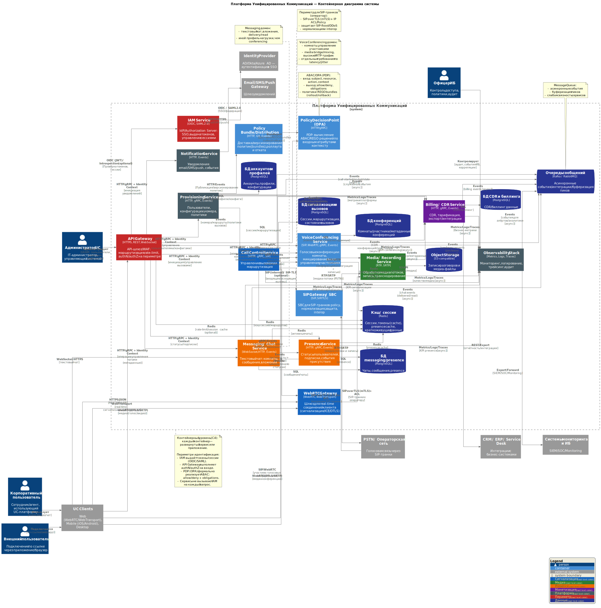

# C4 Container Diagram

## Назначение диаграммы

Диаграмма **C4 Container** описывает архитектуру платформы **Унифицированных коммуникаций (UC)** на уровне контейнеров (сервисов и приложений), их зон ответственности и протоколов взаимодействия.

Диаграмма предназначена для:
- фиксации разбиения системы на домены и микросервисы;
- демонстрации границ ответственности между контейнерами;
- отражения ключевых технологических решений (SIP, WebRTC, ABAC/OPA, event-driven);
- объяснения архитектуры как техническим специалистам, так и бизнес-заказчикам.

Контейнерный уровень отвечает на вопрос:  
**«Какие сервисы существуют в системе и как они взаимодействуют между собой?»**

## Основные контейнеры UC-платформы

### Периметр и идентификация
- **API Gateway** — единая точка входа в платформу, выполняет маршрутизацию запросов, rate limiting, первичную аутентификацию и авторизацию.
- **IAM Service** — сервис управления идентификацией и сессиями (OIDC / SAML 2.0), интеграция с внешними IdP.
- **Policy Decision Point (OPA)** — формальная точка принятия решений доступа (ABAC), возвращающая `allow/deny` и *obligations*.
- **Policy Bundle / Distribution** — доставка, версионирование и откат политик доступа (REGO bundles).

### Сигнализация и управление вызовами
- **Call Control Service** — ключевой сервис управления вызовами, маршрутизацией и жизненным циклом сессий.
- **SIP Gateway / SBC** — пограничный контроллер для SIP-транков, нормализация сигнализации, защита и interop с операторами.
- **WebRTC Gateway** — шлюз для real-time соединений клиентов (WebRTC / WebTransport).

### Медиа и конференции
- **Media / Recording Service** — обработка медиапотоков, запись разговоров, транскодирование.
- **Voice Conferencing Service** — отдельный домен голосовых конференций: комнаты, участники, media-bridge, высокий RTP-трафик.

### Messaging и presence
- **Messaging / Chat Service** — текстовые чаты, сообщения, вложения, delivery/read-статусы.
- **Presence Service** — статусы пользователей, подписки, события присутствия.

### Платформа и бизнес-сервисы
- **Provisioning Service** — управление пользователями, номерами, конфигурациями и политиками.
- **Billing / CDR Service** — сбор CDR, тарификация, биллинг и интеграции с CRM/ERP.
- **Notification Service** — отправка email / SMS / push-уведомлений.
- **Observability Stack** — метрики, логи, трассировки, аудит и экспорт в SIEM/SOC.

### Хранилища и инфраструктура данных
- **PostgreSQL (несколько БД по доменам)** — аккаунты, вызовы, CDR, messaging, конференции.
- **Redis** — кэш сессий, маршрутизации, presence и краткоживущих данных.
- **Object Storage (S3-compatible)** — записи разговоров и медиа-файлы.
- **Message Queue (Kafka)** — асинхронные события и интеграции между сервисами.

## Архитектурный смысл и ключевые идеи

Диаграмма отражает следующие архитектурные принципы и решения:

- **Чёткое разделение доменов**  
  Сигнализация, медиа, messaging, presence и conferencing вынесены в отдельные сервисы
  с разными профилями нагрузки и требованиями к latency.

- **Периметр и zero-trust подход**  
  API Gateway и IAM обеспечивают контроль доступа на входе,  
  а PDP (OPA) реализует централизованную модель ABAC с возможностью расширения через obligations.

- **Event-driven архитектура**  
  Асинхронные взаимодействия (CDR, billing, presence, chat, conferencing)
  выполняются через Kafka, что снижает связанность сервисов и сглаживает пики нагрузки.

- **Оптимизация real-time контура**  
  Критические пути сигнализации и медиа минимизируют синхронные зависимости,
  используют кэширование (Redis) и прямые real-time каналы (SIP, WebRTC).

- **Масштабируемость и отказоустойчивость**  
  Каждый контейнер масштабируется независимо,
  что позволяет адаптировать платформу под рост пользователей и трафика.

Диаграмма служит основой для детализации:
- компонентных диаграмм (C4 Component);
- диаграмм развертывания;
- ADR по безопасности, масштабированию и управлению нагрузкой.