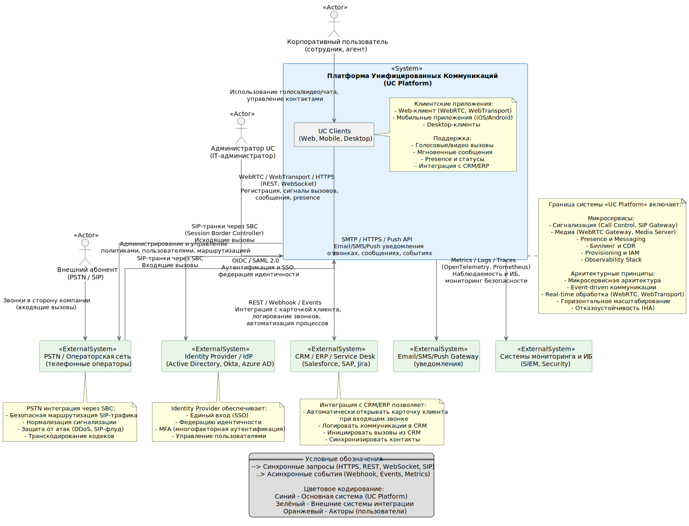

# C4 Context Diagram

## Назначение диаграммы

Диаграмма C4 Context описывает границы платформы унифицированных коммуникаций
(UC Platform), ключевых пользователей системы и внешние системы, с которыми
осуществляется интеграция.

## Основные участники и системы

- Корпоративные пользователи UC-платформы
- Администраторы системы
- Внешние абоненты (PSTN / SIP)
- Внешние системы:
  - Identity Provider
  - CRM / ERP
  - Email / SMS Gateway

## Архитектурный смысл

Диаграмма используется для фиксации контекста системы и служит отправной
точкой для дальнейшей декомпозиции архитектуры.