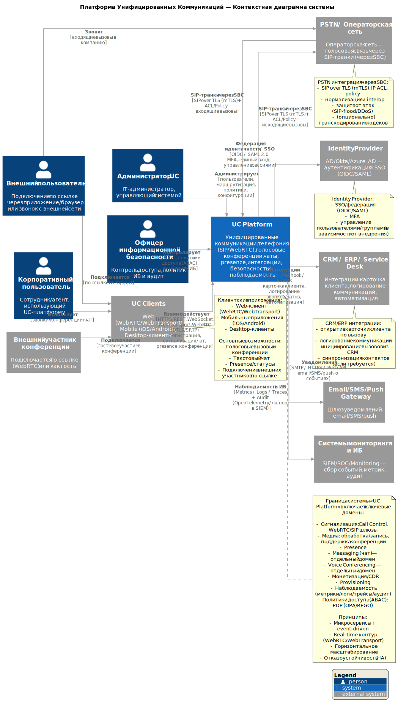

# C4 Context Diagram

## Назначение диаграммы

Диаграмма **C4 Context** описывает границы системы **Платформа унифицированных коммуникаций (UC Platform)**, ключевых акторов (пользователей и ролей) и внешние системы, с которыми платформа взаимодействует.

Диаграмма предназначена для формирования общего понимания:
- **что входит в UC Platform, а что находится за её пределами**;
- **кто является пользователями системы и в каких ролях они выступают**;
- **с какими внешними системами и сетями платформа интегрируется**;
- **какими классами протоколов и каналов осуществляется взаимодействие**.

Контекстный уровень отвечает на вопрос:  
**«В каком окружении работает система и с кем она взаимодействует?»**

## Основные участники и роли

- **Корпоративный пользователь** — сотрудник или агент компании, использующий UC-платформу для голосовых вызовов, конференций, чатов и работы с presence.
- **Администратор UC** — IT-администратор, управляющий пользователями, маршрутами вызовов, конфигурациями и политиками системы.
- **Офицер информационной безопасности** — роль, отвечающая за контроль доступа, аудит, политики ИБ и анализ инцидентов.
- **Внешний пользователь** — абонент, подключающийся по ссылке через браузер/приложение или совершающий вызов из внешней сети.
- **Внешний участник конференции** — гость, подключающийся к голосовой конференции по WebRTC без полноценной учётной записи в системе.

## Граница системы UC Platform

**UC Platform** представляет собой централизованную платформу унифицированных коммуникаций и включает следующие функциональные домены:

- телефония и сигнализация (SIP / WebRTC);
- голосовые конференции;
- текстовый чат и обмен сообщениями;
- presence и статусы пользователей;
- интеграции с бизнес-системами;
- биллинг и CDR;
- политики доступа (ABAC);
- наблюдаемость, аудит и безопасность.

Клиентские приложения (**UC Clients**) сознательно вынесены **за границу платформы** и рассматриваются как внешние потребители API и real-time интерфейсов.

## Внешние системы и интеграции

UC Platform интегрируется со следующими внешними системами:

- **Identity Provider (AD / Okta / Azure AD)**  
  Используется для федерации идентичности, SSO и MFA на базе OIDC / SAML 2.0.

- **CRM / ERP / Service Desk**  
  Интеграции для открытия карточек клиентов, логирования коммуникаций, автоматизации бизнес-процессов и отчётности.

- **PSTN / операторская сеть**  
  Взаимодействие через SIP-транки с использованием SBC, защищённые соединения (SIP over TLS, mTLS, ACL).

- **Email / SMS / Push Gateway**  
  Отправка уведомлений пользователям о событиях вызовов, сообщений и системных действиях.

- **Системы мониторинга и ИБ (SIEM / SOC)**  
  Сбор метрик, логов, трассировок и аудита для наблюдаемости и контроля безопасности.

## Архитектурный смысл

Диаграмма фиксирует **контекст системы** и задаёт рамки всей последующей архитектурной проработки:

- подчёркивает разделение ответственности между платформой и внешними системами;
- демонстрирует наличие разных классов пользователей и сценариев доступа;
- отражает ключевое архитектурное решение о разделении доменов:
  - сигнализация,
  - медиа,
  - messaging (чат),
  - voice conferencing;
- показывает, что безопасность и контроль доступа являются сквозными аспектами архитектуры;
- служит отправной точкой для декомпозиции на контейнерный (C4 Container) и компонентный (C4 Component) уровни.

Диаграмма используется как базовая точка согласования архитектуры с бизнес-заказчиками, архитекторами и командой разработки.