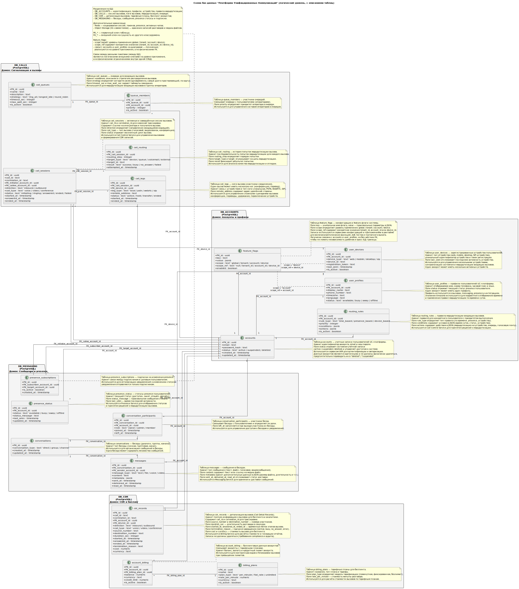

# Database Diagram

## Назначение диаграммы

Диаграмма баз данных описывает **логическую модель хранения данных UC-платформы** на уровне доменных баз данных, таблиц, ключевых полей и связей между сущностями.

Диаграмма фиксирует два принципиальных решения архитектуры данных:

1. **Разделение данных по доменам (database-per-domain)** — каждая доменная подсистема владеет своим набором таблиц и отвечает за целостность данных в пределах своего домена.
2. **Отсутствие физических внешних ключей между доменными БД** — связи между доменами реализуются как **логические ссылки на уровне приложения** (пунктир на диаграмме), что снижает связанность и облегчает независимое развитие сервисов.

## Структура доменных баз данных (PostgreSQL)

### DB_ACCOUNTS (PostgreSQL)  
**Домен: Аккаунты, профили и назначение политик**

- **accounts** — учетные записи пользователей (identity-источник для IAM): email, hash пароля, статус (логическое удаление), временные метки.  
- **user_profiles** — профиль пользователя (1:1 с accounts): имя, телефон, timezone, language.  
  *Presence-статусы намеренно не хранятся здесь и вынесены в DB_MESSAGING, чтобы не смешивать домены «профиль» и «runtime presence».*  
- **user_devices** — зарегистрированные устройства (web/mobile/desktop/sip), multi-device маршрутизация и активность.  
- **feature_flags** — конфигурации и feature toggles с областью применения (global/tenant/account/device).  
  Связь со `scope_ref` является **логической**, без жестких FK.  
- **routing_rules** — пользовательские правила маршрутизации (time/presence/device), используемые Call Control при выборе цели доставки вызова.  
- **policy_assignments** — назначения политик доступа (ABAC/OPA) субъектам и фиксация `policy_bundle_version` для воспроизводимости решений.

### DB_CALLS (PostgreSQL)  
**Домен: Сигнализация и управление вызовами (Call Control)**

- **call_sessions** — сессии вызовов (основная сущность Call Control): `call_id`, `correlation_id`, направление, тип, статусы, временные метки.  
  `initiator_account_id` / `callee_account_id` — **логические ссылки** на accounts (DB_ACCOUNTS).  
- **call_legs** — «ноги» вызова (участники/каналы соединения): тип (pstn/webrtc/sip), адрес удаленной стороны, статусы.  
  `device_id` — **логическая ссылка** на user_devices (DB_ACCOUNTS).  
- **call_routing** — история попыток маршрутизации (шаг, цель, результат), используется для анализа качества маршрутизации и отладки.  
- **call_queues** — очереди вызовов (стратегии распределения, таймауты, SLA-ограничения).  
- **queue_members** — состав очередей (операторы), `account_id` — **логическая ссылка** на accounts.  
- **policy_decision_audit** — аудит решений ABAC/OPA в runtime: действие, ресурс, решение `allow/deny`, obligations, версия policy bundle, время принятия решения.  
  Используется для объяснимости решений и требований security/compliance.

### DB_CDR (PostgreSQL)  
**Домен: Биллинг и детализация (CDR)**

- **cdr_records** — детализация вызовов (CDR): номера, длительность, временные метки, причина завершения, стоимость.  
  `account_id` / `device_id` — **логические ссылки** на DB_ACCOUNTS.  
  Записи не удаляются (audit/compliance).  
- **billing_plans** — тарифные планы (модель тарификации, ставки, валюта).  
- **account_billing** — привязка аккаунта к тарифу и финансовые параметры (баланс, кредитный лимит).  
  `account_id` — **логическая ссылка** на accounts.

### DB_MESSAGING (PostgreSQL)  
**Домен: Сообщения (чат) и presence**

- **conversations** — диалоги/группы/каналы.  
- **conversation_participants** — участники бесед и их роли, `account_id` — **логическая ссылка** на accounts.  
- **messages** — сообщения, тип (text/file/voice/video), контент, метаданные.  
- **message_receipts** — статусы доставки/прочтения по участникам (нормализация delivered/read для групповых сценариев).  
- **message_attachments** — вложения сообщений: `storage_key` (S3 key), тип, размер, checksum.  
- **presence_status** — runtime presence-статус пользователя (available/busy/away/offline), `account_id` — **логическая ссылка** на accounts.  
- **presence_subscriptions** — подписки на presence, связи subscriber/target — **логические ссылки** на accounts.

### DB_CONFERENCES (PostgreSQL)  
**Домен: Голосовые конференции (отдельно от чата)**

- **conferences** — комнаты конференций: модель доступа (`invite_only/org/public_link`), владелец, параметры.  
  `owner_account_id` — **логическая ссылка** на accounts.  
- **conference_participants** — участники конференции (internal/external):  
  - для internal — `account_id` (логическая ссылка на accounts);  
  - для external — `external_ref` (email/phone/guest_id).  
- **conference_sessions** — сессии проведения конференции с `correlation_id` для сквозной наблюдаемости и связи с вызовами/CDR.  
- **conference_recordings** — метаданные записей конференций: `storage_key` (S3 key), длительность.

## Связи и границы целостности данных

- **Внутри каждого домена** (внутри одного package/БД) используются **физические внешние ключи** и ограничения целостности.  
- **Между доменами** связи реализуются как **логические ссылки на уровне приложения** (например, `account_id`, `device_id`, `correlation_id`).  
  Это соответствует микросервисному стилю и исключает зависимость на уровне СУБД между независимыми доменами.

Ключевые «сквозные» идентификаторы, обеспечивающие трассируемость:
- `call_id` — идентификатор вызова;
- `correlation_id` — сквозной идентификатор запроса/сессии для logs/traces/CDR и связей call_sessions ↔ conference_sessions.

## Дополнительные хранилища (вне PostgreSQL)

- **Redis** — кэширование и краткоживущие данные: сессии вызовов, кэш маршрутизации, presence cache, active chats, rate-limit counters.  
- **Object Storage (S3-compatible)** — медиа-объекты и большие бинарные данные:
  - записи разговоров и конференций;
  - вложения сообщений;
  - аватары и прочие медиа-ассеты.

## Архитектурный смысл

Диаграмма демонстрирует:

- **Разделение по доменам** — DB_ACCOUNTS, DB_CALLS, DB_CDR, DB_MESSAGING, DB_CONFERENCES соответствуют доменной декомпозиции сервисов и позволяют развивать подсистемы независимо.
- **Изоляцию и безопасность** — критичные данные (identity, биллинг, аудит решений ABAC) выделены в отдельные домены, упрощая контроль доступа и соответствие требованиям compliance.
- **Поддержку ABAC/OPA** — наличие `policy_assignments` и `policy_decision_audit` обеспечивает управляемость политик и воспроизводимость решений в runtime.
- **Масштабируемость** — database-per-domain снижает конкуренцию за ресурсы и позволяет масштабировать домены с разным профилем нагрузки (calls vs messaging vs conferences).
- **Связи без cross-DB FK** — снижает связанность, но требует дисциплины контрактов данных и корректной обработки консистентности на уровне приложений (event-driven, idempotency, retry).

Диаграмма поддерживает архитектурные драйверы **AD-01**, **AD-03**, **AD-05** и решения из **ADR-003**, **ADR-010**.