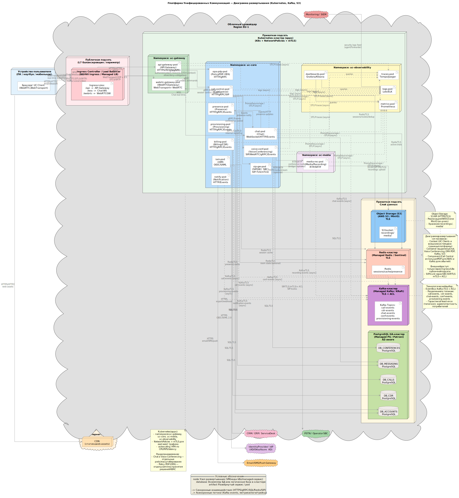

# Deployment Diagram

## Назначение диаграммы

Диаграмма развертывания описывает целевую модель размещения UC-платформы
в инфраструктуре.

## Модель развертывания

- Kubernetes-кластер
- Ingress / Load Balancer
- Микросервисы UC-платформы
- Базы данных
- Брокеры сообщений
- Система мониторинга и логирования

## Архитектурные допущения

- Горизонтальное масштабирование сервисов
- Высокая доступность критичных компонентов
- Изоляция окружений (prod / stage)