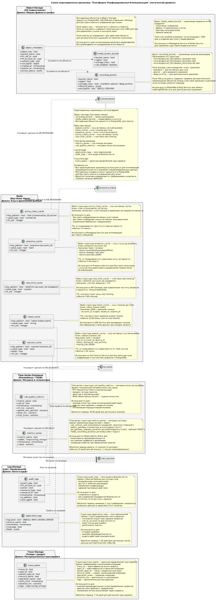

# NoSQL Database Diagram

## Назначение диаграммы

Диаграмма нереляционных хранилищ описывает **специализированные хранилища UC-платформы**, которые дополняют доменные PostgreSQL БД. В отличие от схемы реляционных БД, здесь зафиксированы:

- **конкретный технологический выбор** из deployment-диаграммы: **Kafka** как единая event-bus и **S3 API (AWS S3 / MinIO)** для медиа;
- **паттерны доступа и надежности**: idempotency/dedup при `at-least-once`, контролируемый доступ к объектам S3 через **pre-signed URL**, а также необходимость Outbox/Inbox (логически) для связки «БД → Kafka»;
- **доменные особенности нагрузки**: выделение voice conferencing отдельно от chat, и наличие хранилища/каталога **OPA bundles** для ABAC.

## Структура нереляционных хранилищ

### Object Storage (S3 API: AWS S3 / MinIO)
**Домен: Медиа-файлы и записи**

Object Storage используется для хранения крупных бинарных объектов (записи, вложения, ассеты), а доступ к чувствительным данным реализуется **не прямой выдачей объектов**, а через **контролируемые временные ссылки**.

- **recording_bucket** — записи разговоров и конференций  
  - Рекомендуемая структура ключей:  
    - `recordings/calls/{call_id}/{session_id}/audio.opus`  
    - `recordings/calls/{call_id}/{session_id}/video.webm`  
    - `recordings/conferences/{conf_session_id}/mix.opus`  
    - `transcripts/{call_id}/{session_id}/stt.json`  
  - Классы хранения и lifecycle/retention задаются политиками бакета (архивирование/удержание/удаление).  
  - Запись выполняет **Media/Recording Service**, чтение — через **pre-signed URL** при проверке прав (ABAC/OPA).

- **media_assets_bucket** — медиа-ассеты (вложения чатов, voice messages, аватары, превью)  
  - Для ассетов допускается интеграция с CDN, но **записи разговоров** и иные защищённые объекты должны проходить через авторизацию и аудит.  

- **object_index** — логический индекс объектов S3  
  - Индекс хранится в PostgreSQL доменов (например, `DB_CDR / DB_MESSAGING / DB_CONFERENCES`), но на диаграмме вынесен как отдельная сущность каталога, чтобы показать:  
    - быстрый поиск без сканирования бакетов;  
    - контроль `retention_until` (compliance-удержание);  
    - привязку к владельцу и классу доступа (`access_policy_ref`).  

- **presigned_url_lease** — учёт выдачи pre-signed URL  
  - Нужен для аудита доступа, ограничения времени жизни, отзыва и трассируемости «кто/когда/зачем получил ссылку».  
  - События выдачи/отзыва должны попадать в **audit logs** (security/compliance).

### Redis (Key-Value Store)
**Домен: Кэш, сессии, идемпотентность**

Redis используется как “hot path” для низкой задержки и для корректной работы при `at-least-once` доставке событий.

- **session_cache** — кэш активных сессий/состояний (Call Control hot path)
- **token_cache** — кэш токенов/сессий (снижение нагрузки на IAM/DB)
- **presence_cache** — кэш presence-статусов
- **active_chats_cache** — временные структуры активности в чатах (WebSocket слой)
- **rate_limit_cache** — rate limiting на периметре (API Gateway)
- **routing_cache** — кэш результатов маршрутизации (ускорение Routing Engine)
- **idempotency_keys** — ключи идемпотентности/дедупликации  
  - Критично при Kafka `at-least-once`: защищает от повторной обработки сообщений и повторных команд клиента.  
  - TTL должен покрывать окно возможной повторной доставки/ретраев (например, 24–72 часа).

### Kafka (Event Bus)
**Домен: События и интеграции (единая event-bus)**

Kafka выбрана как единая шина событий, обеспечивающая слабую связность сервисов, асинхронные интеграции и буферизацию пиков нагрузки.

- Топики по доменам:
  - **call-events** — жизненный цикл вызова
  - **cdr-events** — события детализации/тарификации
  - **chat-events** — события доставки/прочтения/активности чата
  - **presence-events** — события presence
  - **conf-events** — события voice conferencing
- **consumer_groups** — логические группы консьюмеров  
  - Семантика доставки типично `at-least-once`, поэтому обязательны:
    - **идемпотентность** (Redis `idempotency_keys`) и/или
    - Inbox/Outbox (логически) на уровне сервисов.
- **schema_registry** (опционально, но рекомендуется)  
  - Фиксирует контракт событий и снижает риск несовместимых изменений между командами/сервисами.

### Policy Storage (OPA bundles)
**Домен: ABAC/REGO политики**

Компоненты хранения политик выделены отдельно, потому что PDP (OPA) требует управляемой доставки/версионирования политик.

- **policy_bundles** — каталог версий политик (bundle_id/version/checksum/source)  
  - Реализация может быть Git/HTTP или S3 (например, `policy-bundles/`), важно наличие версий и контроль целостности.
- **policy_cache** — кэш активной версии политик  
  - Может быть in-memory в OPA или shared-cache в Redis для ускорения rollout/rollback.

### Time-Series Database (Prometheus / TSDB)
**Домен: Метрики и телеметрия**

- **metrics_series** — системные метрики (нагрузка, latency, RPS, ошибки)
- **call_quality_metrics** — качество медиа (RTT, loss, jitter, MOS)  
  - Важно, что корреляция должна выполняться по `correlation_id/trace_id`, чтобы связывать ухудшение качества с конкретным маршрутом/сессией.

### Log Storage (Loki / Elasticsearch)
**Домен: Логи и аудит**

- **application_logs** — структурированные логи сервисов (корреляция с trace_id)
- **audit_logs** — аудит ИБ и действий пользователей/админов  
  - В обязательные категории событий должны входить:
    - выдача/отзыв **pre-signed URL**;
    - **ABAC решения** allow/deny и применённые obligations;
    - изменения конфигураций/политик и админские операции.

### Trace Storage (Tempo / Jaeger)
**Домен: Распределённая трассировка**

- **trace_spans** — spans распределённой трассировки  
  - Используется для поиска “узких мест” в цепочках gRPC/HTTP и корреляции с логами/метриками.

## Архитектурный смысл

Диаграмма демонстрирует ключевые решения и последствия:

- **Специализация хранилищ** под разные типы данных и профили нагрузки:
  - S3 — медиа/записи/вложения (большие бинарные объекты),
  - Redis — низкая задержка и временные структуры,
  - Kafka — асинхронные доменные события и интеграции,
  - Observability stack — метрики/логи/трейсы.
- **Контролируемый доступ к медиа**: записи и вложения выдаются через **pre-signed URL** только после проверки прав (ABAC/OPA) и с обязательным аудитом.
- **Надёжность при at-least-once**: наличие Kafka приводит к обязательным механизмам идемпотентности/дедупликации и (логически) Outbox/Inbox для безопасной связки «транзакция в БД → публикация события».
- **Изоляция доменов нагрузки**: Chat и Voice Conferencing различаются по протоколам и профилю трафика, поэтому события и кэши разделены доменно (topic’и, ключи, TTL).
- **Управляемость политик доступа**: хранение и версионирование OPA bundles поддерживает воспроизводимость решений и безопасный rollout/rollback.

Диаграмма согласована с Container и Deployment: **Kafka** закреплена как единая event-bus, **S3 API** — как технологический выбор для объектного хранения, а ABAC/OPA — как отдельный домен инфраструктурной ответственности.