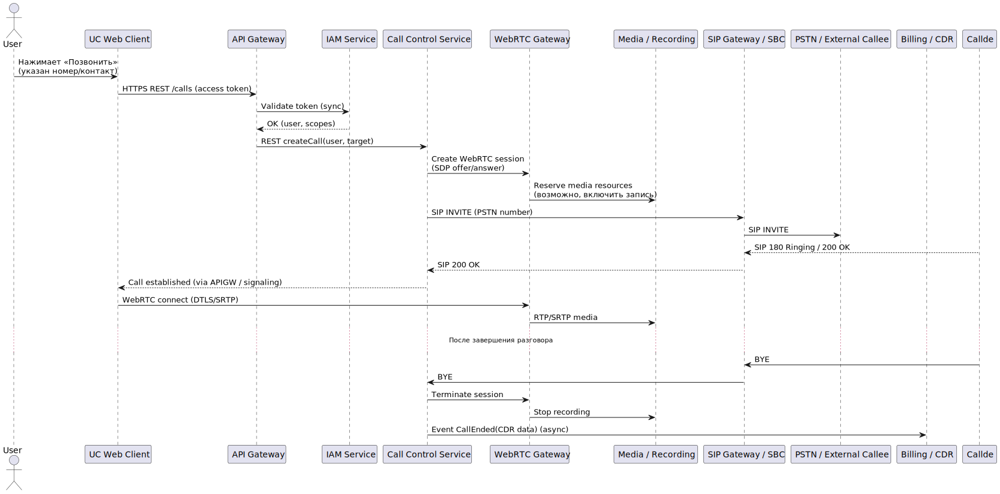
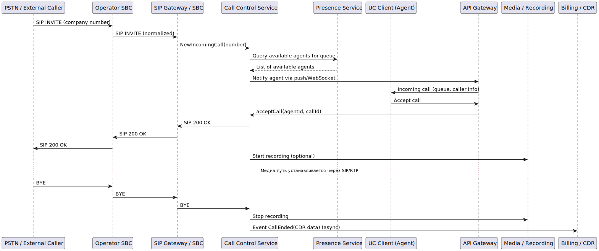
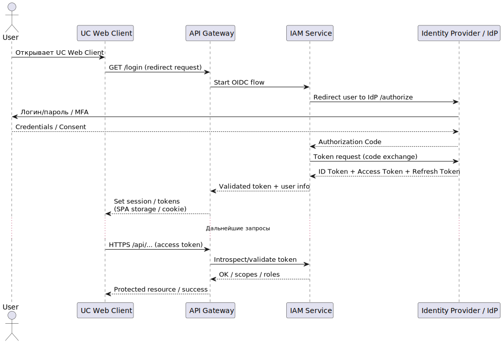

# Диаграммы последовательности (Sequence Diagrams)

Данный раздел содержит диаграммы последовательности, описывающие ключевые
пользовательские сценарии работы платформы унифицированных коммуникаций (UC Platform).
Диаграммы иллюстрируют взаимодействие клиентов, шлюзов и микросервисов
в рамках основных бизнес-процессов.

---

## Исходящий вызов (Outgoing Call)

### Назначение сценария

Сценарий описывает процесс инициирования исходящего голосового вызова
пользователем UC-платформы.

### Основные шаги

- Пользователь инициирует вызов через клиент (WebRTC / SIP).
- Клиент обращается к API UC-платформы.
- Call Control Service обрабатывает логику вызова.
- Вызов маршрутизируется через SIP Gateway / SBC.
- Устанавливается медиасессия.

### Архитектурный смысл

Диаграмма демонстрирует:
- разделение сигнальной и медиаплоскости;
- централизованную логику управления вызовами;
- использование шлюзов для интеграции с внешними сетями.

---

## Входящий вызов (Incoming Call)

### Назначение сценария

Сценарий описывает обработку входящего вызова,
поступающего в UC-платформу из внешней сети (PSTN / SIP-оператор).

### Основные шаги

- Входящий вызов поступает на SIP Gateway / SBC.
- Gateway передаёт сигнализацию в Call Control Service.
- Определяется маршрут и целевой пользователь.
- Клиент пользователя уведомляется о входящем вызове.
- Устанавливается медиасессия.

### Архитектурный смысл

Диаграмма отражает:
- роль SBC как пограничного элемента безопасности;
- централизованную маршрутизацию вызовов;
- изоляцию внешней сети от внутренней логики платформы.

---

## Аутентификация пользователя и получение токена

### Назначение сценария

Сценарий описывает процесс аутентификации пользователя
и получения access token для доступа к сервисам UC-платформы.

### Основные шаги

- Пользователь инициирует вход через клиентское приложение.
- Клиент обращается к Identity / IAM Service.
- Производится проверка учётных данных.
- Генерируется и возвращается access token.
- Токен используется для последующих вызовов API.

### Архитектурный смысл

Диаграмма демонстрирует:
- централизованную модель управления идентификацией;
- использование токенов для межсервисного и клиентского доступа;
- отделение IAM-логики от бизнес-сервисов.

---

## Связь с архитектурой

Диаграммы последовательности напрямую связаны:
- с пользовательскими сценариями (Use Cases);
- с архитектурными драйверами (безопасность, масштабируемость, отказоустойчивость);
- с архитектурными решениями, зафиксированными в ADR.