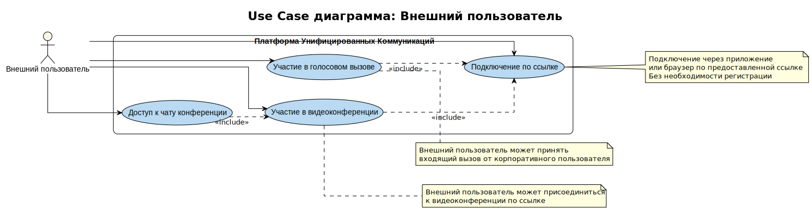

# UC-02. Use Cases внешнего пользователя

**Проект:** Корпоративная платформа унифицированных коммуникаций  
(**Unified Communications, UC**)

---

## Описание

Диаграмма Use Case для актора **Внешний пользователь** описывает функциональные возможности UC-платформы для пользователей, не являющихся сотрудниками организации, но подключающихся по предоставленным ссылкам.

## Актор

**Внешний пользователь** — любой человек, подключающийся по ссылке через приложение или браузер без необходимости регистрации в системе.

## Use Cases

### UC-JoinByLink. Подключение по ссылке
**Описание:** Подключение к UC-платформе через предоставленную ссылку без необходимости регистрации или аутентификации. Поддержка подключения через веб-браузер или мобильное приложение.  
**Связь с требованиями:** FR-12

### UC-JoinConference. Участие в видеоконференции
**Описание:** Присоединение к видеоконференции по ссылке с поддержкой аудио/видео и чата конференции.  
**Связь с требованиями:** FR-03, FR-12

### UC-JoinCall. Участие в голосовом вызове
**Описание:** Принятие входящего вызова от корпоративного пользователя или присоединение к голосовому вызову по ссылке.  
**Связь с требованиями:** FR-02, FR-12

### UC-ConferenceChat. Доступ к чату конференции
**Описание:** Участие в текстовом чате конференции при подключении к видеоконференции.  
**Связь с требованиями:** FR-03, FR-04

## Зависимости

- UC-JoinConference **включает** UC-JoinByLink (необходимо подключение по ссылке)
- UC-JoinCall **включает** UC-JoinByLink (необходимо подключение по ссылке)
- UC-ConferenceChat **включает** UC-JoinConference (чат доступен только в конференции)

## Особенности

Внешние пользователи имеют ограниченный набор функций по сравнению с корпоративными пользователями:
- Нет доступа к адресной книге и контактам
- Нет возможности инициировать исходящие вызовы (кроме случаев, когда это разрешено политикой)
- Нет доступа к истории сообщений и записям разговоров
- Подключение возможно только по предоставленным ссылкам

## Трассируемость

Диаграмма поддерживает архитектурные драйверы **AD-01**, **AD-03** и решения из ADR-001, ADR-004.
