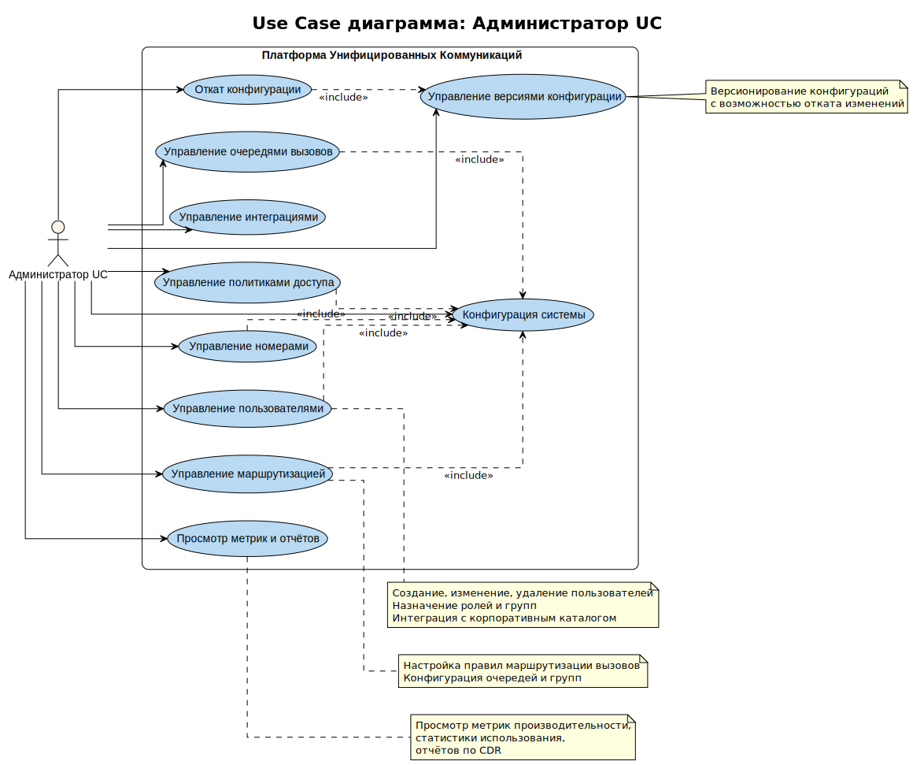

# UC-03. Use Cases администратора UC

**Проект:** Корпоративная платформа унифицированных коммуникаций  
(**Unified Communications, UC**)

---

## Описание

Диаграмма Use Case для актора **Администратор UC** описывает функциональные возможности UC-платформы для управления системой, пользователями, конфигурацией и интеграциями.

## Актор

**Администратор UC** — IT-администратор, управляющий системой, пользователями, конфигурацией, маршрутизацией и интеграциями.

## Use Cases

### UC-ManageUsers. Управление пользователями
**Описание:** Создание, изменение, удаление пользователей. Назначение ролей и групп. Интеграция с корпоративным каталогом (AD/LDAP/IdP).  
**Связь с требованиями:** FR-01, FR-10  
**Связь с sequence диаграммами:** UC-06

### UC-ManageNumbers. Управление номерами
**Описание:** Назначение и управление телефонными номерами (DID), планами набора, правилами нормализации номеров.  
**Связь с требованиями:** FR-10, FR-11

### UC-ManagePolicies. Управление политиками доступа
**Описание:** Настройка политик доступа (RBAC/ABAC), правил безопасности, политик маршрутизации и обработки вызовов.  
**Связь с требованиями:** FR-01, FR-10, FR-11

### UC-ManageRouting. Управление маршрутизацией
**Описание:** Настройка правил маршрутизации вызовов, конфигурация очередей и групп операторов, расписаний работы.  
**Связь с требованиями:** FR-11  
**Связь с sequence диаграммами:** UC-06

### UC-ManageQueues. Управление очередями вызовов
**Описание:** Создание и настройка очередей вызовов, стратегий распределения (round-robin, longest-idle, skills-based), приоритетов.  
**Связь с требованиями:** FR-11

### UC-ConfigureSystem. Конфигурация системы
**Описание:** Общее управление конфигурацией системы, параметрами сервисов, интеграциями и настройками платформы.  
**Связь с требованиями:** FR-10

### UC-ManageIntegrations. Управление интеграциями
**Описание:** Настройка интеграций с внешними системами (CRM/ERP/Service Desk), конфигурация webhooks и событийных интеграций.  
**Связь с требованиями:** FR-06, FR-10

### UC-ViewReports. Просмотр метрик и отчётов
**Описание:** Просмотр метрик производительности, статистики использования, отчётов по CDR и аналитики.  
**Связь с требованиями:** FR-08, FR-13

### UC-ConfigVersioning. Управление версиями конфигурации
**Описание:** Версионирование конфигураций с возможностью отслеживания изменений и истории версий.  
**Связь с требованиями:** FR-10

### UC-ConfigRollback. Откат конфигурации
**Описание:** Откат конфигурации к предыдущей версии при необходимости восстановления работоспособности системы.  
**Связь с требованиями:** FR-10

## Зависимости

- UC-ManageUsers, UC-ManageNumbers, UC-ManagePolicies, UC-ManageRouting, UC-ManageQueues **включают** UC-ConfigureSystem (все операции требуют доступа к конфигурации)
- UC-ConfigRollback **включает** UC-ConfigVersioning (откат возможен только при наличии версионирования)

## Особенности

Административные операции требуют:
- Аутентификации с правами администратора
- Аудита всех изменений конфигурации
- Версионирования критичных изменений
- Возможности отката изменений

## Трассируемость

Диаграмма поддерживает архитектурные драйверы **AD-01**, **AD-06**, **AD-07** и решения из ADR-001, ADR-008.
