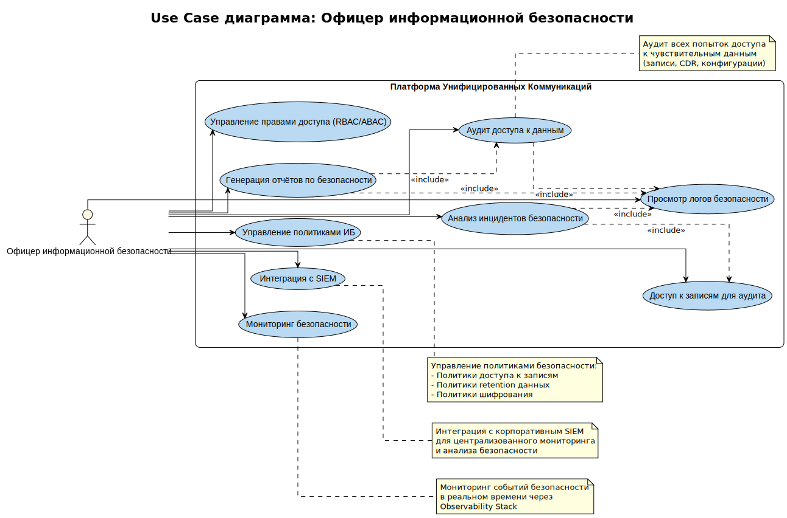

# UC-04. Use Cases офицера информационной безопасности

**Проект:** Корпоративная платформа унифицированных коммуникаций  
(**Unified Communications, UC**)

---

## Описание

Диаграмма Use Case для актора **Офицер информационной безопасности** описывает функциональные возможности UC-платформы для мониторинга безопасности, аудита доступа и управления политиками информационной безопасности.

## Актор

**Офицер информационной безопасности** — специалист по безопасности, контролирующий доступ и политики ИБ, мониторинг безопасности и аудит действий.

## Use Cases

### UC-SecurityMonitoring. Мониторинг безопасности
**Описание:** Мониторинг событий безопасности в реальном времени через Observability Stack. Отслеживание подозрительной активности, попыток несанкционированного доступа, аномалий в поведении системы.  
**Связь с требованиями:** FR-13, FR-14

### UC-AccessAudit. Аудит доступа к данным
**Описание:** Просмотр и анализ всех попыток доступа к чувствительным данным (записи разговоров, CDR, конфигурации, пользовательские данные). Аудит действий пользователей и администраторов.  
**Связь с требованиями:** FR-14

### UC-SecurityPolicies. Управление политиками ИБ
**Описание:** Настройка политик безопасности: политики доступа к записям, политики retention данных, политики шифрования, политики аутентификации и авторизации.  
**Связь с требованиями:** FR-01, FR-07, FR-14

### UC-SecurityLogs. Просмотр логов безопасности
**Описание:** Просмотр и анализ логов безопасности, событий аудита, попыток доступа и изменений конфигурации. Фильтрация и поиск по различным критериям.  
**Связь с требованиями:** FR-14

### UC-RecordingAudit. Доступ к записям для аудита
**Описание:** Доступ к записям разговоров для целей аудита и расследования инцидентов безопасности с полным контролем доступа и логированием.  
**Связь с требованиями:** FR-07, FR-14  
**Связь с sequence диаграммами:** UC-08

### UC-IncidentAnalysis. Анализ инцидентов безопасности
**Описание:** Анализ инцидентов безопасности на основе логов, записей разговоров и метрик системы. Корреляция событий и построение цепочки действий.  
**Связь с требованиями:** FR-14, FR-15

### UC-AccessControl. Управление правами доступа (RBAC/ABAC)
**Описание:** Настройка и управление правами доступа на основе ролей (RBAC) и атрибутов (ABAC). Определение политик доступа к ресурсам системы.  
**Связь с требованиями:** FR-01, FR-14

### UC-SIEMIntegration. Интеграция с SIEM
**Описание:** Интеграция с корпоративной системой SIEM для централизованного мониторинга и анализа безопасности. Экспорт логов и событий безопасности.  
**Связь с требованиями:** FR-14

### UC-SecurityReports. Генерация отчётов по безопасности
**Описание:** Генерация отчётов по безопасности, аудиту доступа, инцидентам и соответствию регуляторным требованиям.  
**Связь с требованиями:** FR-14

## Зависимости

- UC-AccessAudit **включает** UC-SecurityLogs (аудит основан на анализе логов)
- UC-IncidentAnalysis **включает** UC-SecurityLogs и UC-RecordingAudit (анализ требует логов и записей)
- UC-SecurityReports **включает** UC-SecurityLogs и UC-AccessAudit (отчёты формируются на основе логов и аудита)

## Особенности

Операции ИБ-специалиста требуют:
- Высокого уровня прав доступа
- Полного аудита всех действий
- Интеграции с корпоративными системами безопасности
- Соответствия регуляторным требованиям (compliance)

## Трассируемость

Диаграмма поддерживает архитектурные драйверы **AD-03**, **AD-05** и решения из ADR-004, ADR-005, ADR-010.
